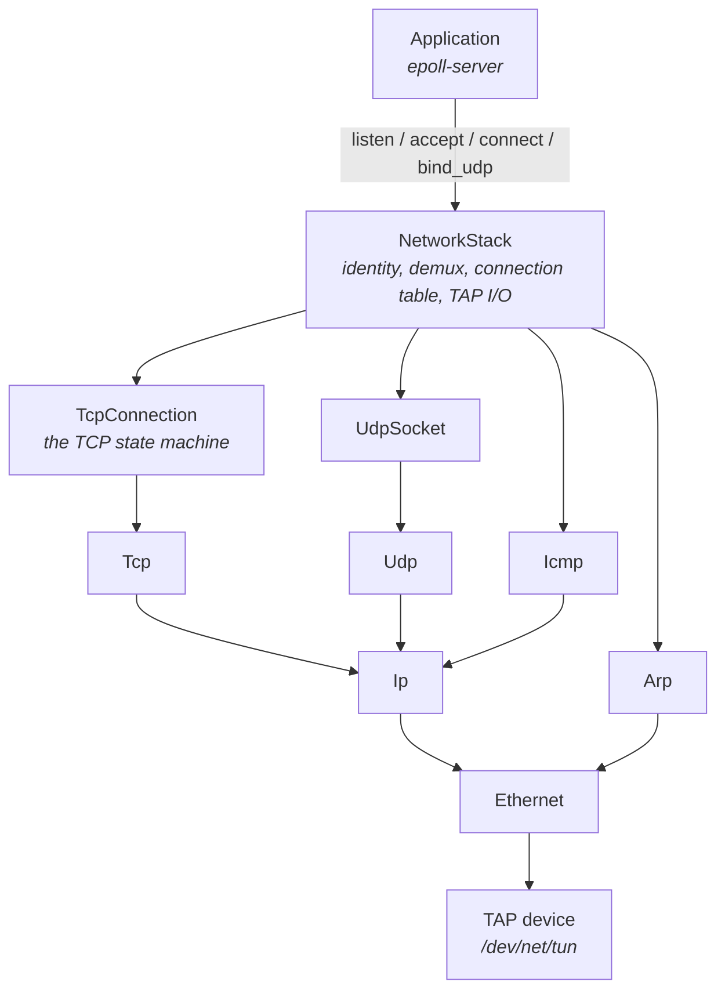

# A TCP/IP stack, from scratch

A userspace TCP/IP stack written in C++17: Ethernet framing, ARP, IPv4, TCP, UDP, and
ICMP, all hand-implemented over a Linux TAP device. No kernel sockets are involved in
the connections it serves. It runs against the real Linux kernel as a peer, and has
been verified doing so.

The point was to stop treating `send()` and `recv()` as opaque, and implement what the
kernel actually does underneath them.



## What it implements

**TCP.** The full RFC 793 state machine, including a real `CLOSING` state for
simultaneous close rather than folding it into `FIN_WAIT_2`. On top of that:

- A sliding window bounded by `min(cwnd, peer's advertised window)`, in bytes
- Classic Reno congestion control (RFC 5681): slow start, congestion avoidance, and
  fast retransmit / fast recovery on three duplicate ACKs
- **Adaptive retransmission timeout** (RFC 6298): round-trip time is sampled from the
  ack clock and smoothed with Jacobson and Karels' estimator, tracking both the mean
  and its variation, with Karn's algorithm rejecting the ambiguous samples that come
  from retransmitted segments and exponential backoff covering the resulting blind spot
- Out-of-order reassembly, bounded by a fixed receive-buffer capacity that also
  determines the advertised window
- MSS and window scale negotiation (RFC 7323), including the rule that scaling applies
  only if *both* SYNs carried the option
- Delayed ACK and Nagle's algorithm, deliberately guarded against their well-known
  pathological interaction
- A zero-window persist timer, whose probe byte is intentionally kept outside the
  in-flight window so it cannot trip the retransmit give-up or the duplicate-ack
  machinery
- Checksum verification on receive, over the bytes *as received* rather than a
  re-serialization, and RFC 793 section 3.4 RST generation for segments matching no
  connection

**IP.** Header parse and serialize, checksum computation and verification, and
fragmentation in both directions - splitting oversized outbound datagrams, and
reassembling inbound ones. Reassembly refuses overlapping fragments rather than
resolving them, which is the defence against the fragment-overlap evasion class,
and bounds how much a peer can make it hold for datagrams that never complete.

**ARP.** Request and reply in both directions, with a time-based TTL refreshed on
received traffic, so an actively-talking peer never ages out mid-conversation. The table
is bounded, and the stack only learns from ARP that targets its own address, so a shared
segment cannot fill it or overwrite mappings it is using.

**Two transports.** A TAP device, or an `AF_PACKET` socket on a physical NIC, both behind
one `PacketChannel` seam that nothing downstream can distinguish. The real-NIC path
adopts the interface's own hardware address, which is what lets the card filter frames in
hardware and is why promiscuous mode is never needed. See
[docs/running-on-a-real-nic.md](docs/running-on-a-real-nic.md).

**UDP.** A connectionless `UdpSocket` with bind, `send_to`, and a receive callback.
Sending to a peer whose MAC is not yet known queues the datagram and kicks off a
bounded ARP resolution, the same way an active TCP open does.

**ICMP.** Echo Request and Reply (so a real `ping` gets an answer), Destination
Unreachable / Port Unreachable both generated and acted upon, and Time Exceeded for a
datagram whose fragments never all arrived. Receiving a Destination Unreachable for a
connection's own segment fails that connection immediately instead of letting it grind
through the full retransmit budget.

**Routing.** A subnet mask, a default gateway, and a route table with longest-prefix
match. Every send decides whether the destination is on-link, and so resolves the
destination itself, or off-link, and so resolves the gateway - the distinction between
the address in the IP header and the address the frame is sent to.

**Timers in real time, not in polling cycles.** The stack takes elapsed milliseconds
from its caller (`on_time_passed`) rather than counting timer ticks, so every timeout in
it means what its RFC says it means no matter how often, or how regularly, the
application gets round to calling. The distinction is not academic: a tick counter
conflates "how often am I polled" with "how much time has passed", so an event loop that
stalls for two seconds delivers one tick and the stack concludes half a second went by -
retransmissions then run late by exactly however overloaded the machine was.

**Flow control that exists rather than being advertised.** Received data waits in a
queue until the application reads it, so an application that stops reading genuinely
closes the window and stops the sender. `send()` is bounded too and reports how much it
accepted, and `listen()` takes a backlog so the accept queue cannot be grown without
limit by a peer.

## Deliberately out of scope

These are documented decisions, not gaps that were missed:

- **SACK is reported and honoured, but recovery is not full RFC 6675.** There is no
  pipe estimate driving transmission during recovery, and no rescue retransmission.
  The scoreboard both would need does exist.
- **No forwarding.** A packet addressed to somebody else is dropped rather than passed
  on. Next-hop selection exists, so this stack can *reach* anything routable, but
  forwarding additionally needs more than one interface, which it does not have.
- **ISN generation is RFC 793's clock-driven scheme**, not RFC 6528's unpredictable
  one. Do not put this on a hostile network.
- **The reorder buffer keys exact sequence numbers** rather than merging overlapping
  ranges, so a partially overlapping segment is kept or dropped whole.
- **`TIME_WAIT` assumes a 30-second MSL**, so it runs for 60 seconds rather than RFC
  793's 4 minutes. Linux makes the same call, for the same reason: the RFC's figure was
  calibrated for a network whose delays no longer exist, and holding per-connection
  state that long is a real cost on a busy server.

## Building

Requires a Linux toolchain with C++17. Everything below assumes GNU Make and `g++`.

```sh
make            # build the test runner
make test       # build and run the full test suite
make clean
```

The root Makefile builds the stack's objects and its tests. The program built on top of
the stack is [`epoll-server/`](epoll-server/), which has its own Makefile.

There is no native Linux requirement for the *tests* - they run anywhere, because every
component takes an injectable seam instead of touching the OS directly. Running the
stack itself needs `/dev/net/tun` and `NET_ADMIN`. A container works:

```sh
docker run --rm -it --cap-add=NET_ADMIN --device=/dev/net/tun \
    -v "$PWD:/work" -w /work gcc:latest bash
```

## The application on top

[`epoll-server/`](epoll-server/) is a multithreaded TCP echo server built on this
stack. It is more interesting than it sounds, because replacing kernel sockets changes
the concurrency structure completely: there is exactly one real file descriptor (the
TAP device) rather than one per connection, and neither `NetworkStack` nor
`TcpConnection` is thread-safe. So workers compute responses off the reactor thread and
hand results back through an eventfd-backed completion queue, which the reactor drains
and applies itself. See its own README for the full reasoning.

## Testing

143 unit tests covering the protocol codecs, checksums, the TCP state machine, RTT
estimation, flow control, routing, fragment reassembly, ARP ageing, UDP, ICMP, and the
logger, plus a fuzz suite asserting no codec crashes on malformed input.

Two seams make the untestable parts testable without any OS involvement: `PacketChannel`
injects a fake frame transport into `NetworkStack`, and `LoopbackChannel` wires two
complete stacks back to back through a real ARP exchange, handshake, data transfer, and
half-close.

The one component that cannot be unit tested is the `AF_PACKET` transport, since it is
nothing but syscalls. It has an integration test instead, driving the whole stack over a
veth pair against a peer in its own network namespace:

```sh
sudo scripts/veth_test.sh    # needs root, iproute2, ethtool, ping, nc
```

```sh
make test
make asan    # AddressSanitizer + UBSan + leak detection
make tsan    # ThreadSanitizer
```

ASan, UBSan, and leak detection are clean, and CI runs them on every push. They are
worth more here than the pass/fail of the tests: two real bugs, a missing virtual
destructor on a class deleted through a base pointer and enums assigned from wire data
without a fixed underlying type, were both found this way while the entire suite was
passing.

`make tsan` currently proves less, because the unit tests are single-threaded. The
threaded code lives in `epoll-server`, and exercising it needs a TAP device. Note also
that TSan aborts at startup ("incompatible memory layout", exit 66) wherever it cannot
disable ASLR. `make tsan` disables it via `setarch -R` when permitted; under Docker's
default seccomp profile the `personality()` syscall is blocked, so run it with:

```sh
docker run --security-opt seccomp=unconfined ...
```

### Verified against a real kernel

Unit tests are necessary but not sufficient here, and this project has a concrete
lesson about why. Every test used two instances of *this same stack*, which agreed with
each other about a checksum computed over a re-serialization of a parsed segment. The
Linux kernel does not agree, because a real SYN carries options this codec does not
model, so re-serializing it produces different bytes. Every real connection was being
rejected as a bad checksum, and no self-consistent test could ever have shown it.

So the stack is also driven end to end against the kernel: a TAP device in a privileged
container with the kernel side addressed, then exercised with `ping`, `nc`,
`tcpdump`, and a concurrent load test. That confirms ping, TCP echo, RST on a closed
port, UDP port unreachable, and 720 out of 720 load connections.

## Performance

Profiled with `perf` and `callgrind` under concurrent load, not guessed at:

- `_reap_closed_connections()` scanned every connection on every event-loop tick and
  was 13.1% of total self time, the single largest cost in the binary. Replaced with an
  event-driven queue fed by the existing state-change callback: O(closed since last
  reap) instead of O(every connection alive). It no longer appears in the profile.
- Per-field heap allocation in serialization: every header field went through a
  function that allocated a buffer just for the caller to copy and discard it, about 20
  times per packet. Replaced with in-place appends onto a pre-reserved buffer,
  cutting `malloc` from 7.3% to 5.2% and removing several allocator entries from the
  profile entirely.
- Receive-path parse cost cut roughly 56% (4.45B to 1.96B instructions under callgrind)
  by removing a hex-string parse from the address default constructors, a per-field
  allocation in `slice_int`, and payload copies through the parse path.

## License

MIT. See [LICENSE](LICENSE).
